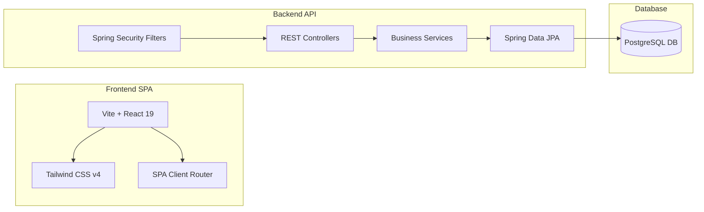

# ExpenseHub - Finance Tracking System

A secure, high-fidelity web application built for Sri Lanka Telecom (Services) Limited take-home assessment. This application allows users to record, manage, and analyze their daily expenses and incomes through a clean, modern, and highly responsive dashboard interface.

---

## 🚀 Features

### 1. User Management
* **Secure Registration**: Register with Name, Email, Address, and Password.
* **JWT-Based Authentication**: Custom Spring Security authentication with stateless JSON Web Tokens.
* **User Profile**: View and edit user details (Name, Address) with read-only Email constraints.

### 2. Expense Management
* **Debit Tracking**: Add expenses with Title, Category, Amount, Transaction Date, and Description.
* **Predefined Categories**: Matches requirements (`Food`, `Transport`, `Bills`, `Shopping`, `Entertainment`, `Other`).
* **CRUD Operations**: Dynamically create, read, update, and delete expense items.

### 3. Income Management
* **Credit Tracking**: Add incomes with Source, Amount, Received Date, and Description.
* **CRUD Operations**: Dynamically create, read, update, and delete income records.

### 4. Financial Dashboard
* **Real-time Metrics**: Displays all-time Total Income, Total Expenses, and Net Balance.
* **Transaction History**: Displays the latest 5 transactions (Income/Expenses merged and sorted).
* **Monthly Allocation**: View total Monthly Expenses and Monthly Income for a selected month/year.
* **Highest Expense Category**: Automatically identifies and displays the highest expense category for the selected month.

---

## 🛠️ Technology Stack

### Database
* **PostgreSQL**: Robust, relational SQL database management system.

### Backend API
* **Java 17 & Spring Boot**: Core API framework.
* **Spring Data JPA**: Database abstraction and queries.
* **Spring Security & JWT**: Roles and security filter chain with JWT authentication.
* **Maven**: Dependency management.

### Frontend UI
* **React 19 & Vite**: Fast development server and build pipeline.
* **Tailwind CSS v4**: Utility-first CSS styling for premium UI.
* **Lucide Icons**: Crisp, vector dashboard icons.
* **React Router v7**: Single Page Application (SPA) client-side routing.

---

## 💻 Local Development Setup (Manual)

### 1. Database Setup
Create a PostgreSQL database named `expensehub` on port `5432` with username `postgres` and password `root`. (If your local credentials differ, update them in `backend/src/main/resources/application.properties`).

### 2. Run Backend API
```bash
cd backend
# Compile and run the Spring Boot app
./mvnw spring-boot:run
```
* The server starts at [http://localhost:8080](http://localhost:8080).

### 3. Run Frontend UI
```bash
cd frontend
# Install packages
npm install

# Run Vite dev server
npm run dev
```
* The web app will be served at the URL printed in your terminal (usually [http://localhost:5173](http://localhost:5173)).

---

## 🧪 Running Test Suites

To execute the unit and integration tests on the Spring Boot backend:
```bash
cd backend
./mvnw test
```

---

## 📂 Architecture & Component Boundaries

The system is split into three clean layers following the **DB → Backend API → Frontend SPA** architecture pattern:



1. **Database Layer**: Implements schemas, primary keys, and foreign keys mapping between Users, Expenses, and Incomes.
2. **Backend Controller/Service Layer**: REST Controllers consume and emit validated DTO payloads (e.g. `RegisterUserRequest`, `DashboardResponse`). Services execute security contexts, hashing, and JPA queries.
3. **Frontend SPA Layer**: Coordinates fetch requests with custom local storage authorization headers, manages React client states, and updates dashboard metrics.